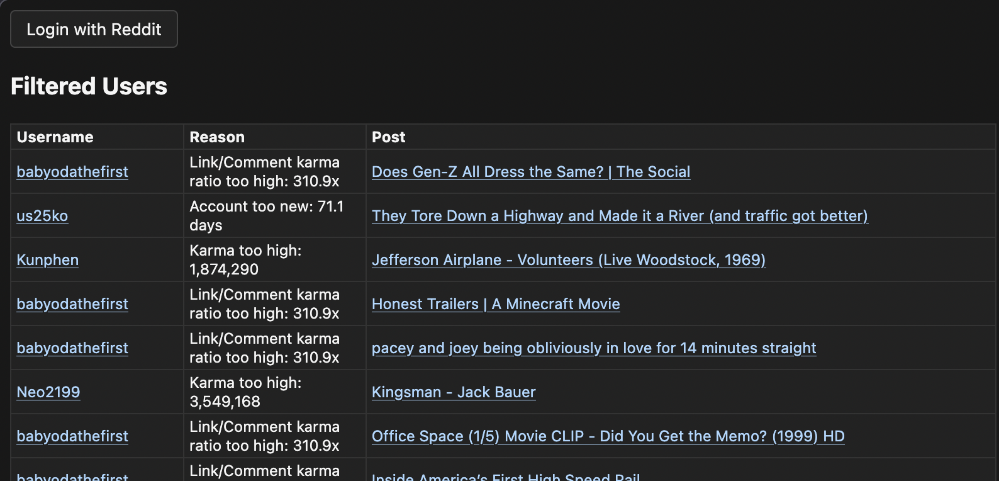

# Reddit Advanced User Filter

A browser extension for more advanced user filtering for Reddit.com, beyond what's currently available in Reddit Enhancement Suite (RES).

## Screenshot



## Features

- Filter users based on multiple criteria:
  - Account age (minimum days)
  - Karma thresholds (minimum and maximum)
  - Email verification status
  - Combined post and comment karma requirements
  - Premium user status
  - Moderator status
  - Link-to-comment karma ratio filtering (e.g. link karma 100x greater than comment karma)

## Setup

1. Clone this repository

2. Create a Reddit application:
   - Go to https://www.reddit.com/prefs/apps
   - Click "create another app..." at the bottom
   - Fill in the following details:
     - Name: "Reddit Advanced User Filter" (or any name you prefer)
     - Select "installed app" as the type
     - About URL: Can be left blank
     - Redirect URI: "https://example.com/reddit_oauth"
   - Click "create app"
   - Note the client ID

3. Create a `config.json` file in the root directory with your Reddit API credentials:
   ```json
   {
     "CLIENT_ID": "YOUR_REDDIT_APP_CLIENT_ID",
     "REDIRECT_URI": "https://example.com/reddit_oauth"
   }
   ```
   Replace `YOUR_REDDIT_APP_CLIENT_ID` with the client ID you noted in the previous step.

4. Load the extension in your browser:
   - Chrome: Go to `chrome://extensions/`, enable "Developer mode", click "Load unpacked" and select the extension directory
   - Firefox: Go to `about:debugging#/runtime/this-firefox`, click "Load Temporary Add-on" and select any file in the extension directory

5. Add the extension to your toolbar and log in:
   - After loading the extension, pin it to your browser's toolbar (in Chrome, click the puzzle piece icon and pin the extension).
   - Click the extension icon in your toolbar.
   - In the popup, click the **Login with Reddit** button to authenticate and grant the extension access.

## Configuration

The extension can be configured through the `options.json` file with the following settings:

- `minAccountAgeDays`: Minimum account age in days (default: 90)
- `minKarma`: Minimum karma threshold (default: 10)
- `maxKarma`: Maximum karma threshold (default: 1500000)
- `requireVerifiedEmail`: Whether to require verified email (default: false)
- `requireBothKarmaTypes`: Whether to require both post and comment karma (default: true)
- `excludePremium`: Whether to exclude premium users (default: false)
- `excludeMods`: Whether to exclude moderators (default: false)
- `linkKarmaRatio`: Filter users whose link karma exceeds their comment karma by this ratio (default: 100)

## Limitations

Due to Reddit's API restrictions, the extension is subject to the following rate limits:

- 100 queries per minute (QPM) per OAuth client ID
- QPM limits are averaged over a 10-minute window, allowing for some request bursting
- Due to using implicit grant flow for authentication, login tokens expire after 1 hour and require re-authentication (I know this is not ideal, but changing this would require major restructuring)

## License

MIT License - see LICENSE file for details 