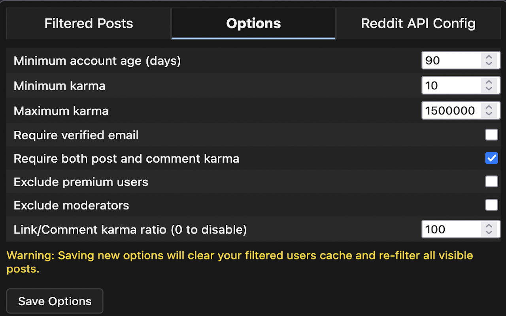

# Reddit Advanced User Filter

A browser extension that filters Reddit posts based on user account age, karma, and other criteria. Provides extra account filtering options beyond what's available in Reddit Enhancement Suite (RES).




## Features

- Filter users based on multiple criteria:
  - Account age (minimum days)
  - Karma thresholds (minimum and maximum)
  - Email verification status
  - Combined post and comment karma requirements
  - Premium user status
  - Moderator status
  - Link-to-comment karma ratio filtering (e.g. link karma 100x greater than comment karma)

## Installation

Firefox: Coming Soon

Chrome: Coming Soon

### Development Installation
1. Clone this repository
2. Generate your `manifest.json`. This project maintains two manifest versions:
   - `manifest-chrome.json`: Manifest V3 for Chrome Web Store
   - `manifest-firefox.json`: Manifest V2 for Firefox Add-ons

   To switch between manifests for development or testing:

   ```bash
   # For Chrome development
   node switch-manifest.js chrome

   # For Firefox development
   node switch-manifest.js firefox
   ```
3. Load the extension in your browser:
   - Chrome: Go to `chrome://extensions/`, enable "Developer mode", click "Load unpacked" and select the extension directory
   - Firefox: Go to `about:debugging#/runtime/this-firefox`, click "Load Temporary Add-on" and select any file in the extension directory


## Configuration

1. Add the extension to your toolbar and open the popup:
   - After loading the extension, pin it to your browser's toolbar (in Chrome, click the puzzle piece icon and pin the extension)
   - Click the extension icon in your toolbar

2. Set up Reddit API access:
   - Go to the "Reddit API Config" tab
   - Create a Reddit app at https://www.reddit.com/prefs/apps
   - Click "create another app..." at the bottom
   - Fill in the following details:
     - Name: "Reddit Advanced User Filter" (or any name you prefer)
     - Select "installed app" as the type
     - About URL: Can be left blank
     - Redirect URI: "https://example.com/reddit_oauth"
   - Click "create app"
   - Copy the client ID (the 14-character string under "installed app")
   - Paste your client ID into the extension popup
   - Click "Login with Reddit" to authenticate and grant the extension access

3. Configure filter options:
   - Go to the "Options" tab
   - Adjust the following settings:
     - Minimum account age in days (default: 90)
     - Minimum karma threshold (default: 10)
     - Maximum karma threshold (default: 1500000)
     - Whether to require verified email (default: false)
     - Whether to require both post and comment karma (default: true)
     - Whether to exclude premium users (default: false)
     - Whether to exclude moderators (default: false)
     - Link-to-comment karma ratio (default: 100)
   - Click "Save Options" to apply your changes

## Limitations

Due to Reddit's API restrictions, the extension is subject to the following rate limits:

- 100 queries per minute (QPM) per OAuth client ID
- QPM limits are averaged over a 10-minute window, allowing for some request bursting
- Due to using implicit grant flow for authentication, login tokens expire after 1 hour and require re-authentication (I know this is not ideal, but changing this would require major restructuring)

## License

MIT License - see [LICENSE](LICENSE) for details.

## Author

Kole Myers - [GitHub](https://github.com/kolemyers)